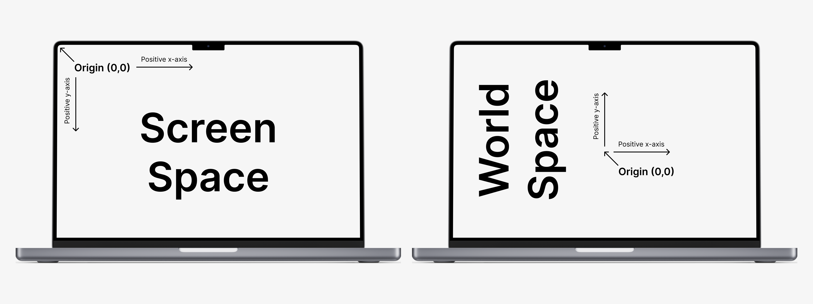

# Engine Docs

This sections contains the full in-depth documentation of the classes and interactions of classes that make GameKit
function.

## Application

This is the heart of a GameKit program. A game or application must extend this class to do anything with the engine.

`Application` runs a fixed-step game loop which processes input, updates and renders the current scene and runs
end-of-frame tasks. This fixed time step approach makes sure during lag spikes don't overshoot logic and physics
updates.

When the application is run, it sets up the engine internals which include:

- Creating the window object
- Attaching keyboard and mouse listeners to the window
- Making the window visible

After setup, the game loop starts which runs the following until the application exits:

- Captures keyboard and mouse input
- Updates running animations
- Updates active timeout tasks
- Update the active scene
- Renders the current scene to the window

The game loops continues running until the close event is received on the window. When this happens, the loop is halted
and the application runs its dispose logic before exiting. You can override the `onDispose()` to custom cleanup before
the application exits.

To access the application from anywhere in the application, use `Application.getInstance()`.

## Window

This is the [JFrame](https://docs.oracle.com/javase/8/docs/api/javax/swing/JFrame.html) window which displays the
application.

In screen space, the origin (I.e. (0,0)) is at the top-left of the screen, +x is to the right of the screen and +y is to
the bottom of the screen. This doesn't translate to world/scene space which uses a cartesian coordinate system where the
origin is at the center of the screen, +x is to the right and +y is upwards.



To allow for both world/scene space and screen space rendering, `Window` provides
two [BufferedImage](https://docs.oracle.com/javase/8/docs/api/java/awt/image/BufferedImage.html)
objects; one for rendering scene elements the other for rendering screen elements.

At the end of `Application.onRender()`, the window is redrawn with the content of the scene layer and text layer.

| Method                               | Description                               |
|--------------------------------------|-------------------------------------------|
| `public static Window getInstance()` | Get the current instance of the window    |
| `public int getWidth()`              | Get the width of the window               |
| `public int getHeight()`             | Get the height of the window              |
| `public int getCenterX()`            | Get the x-coordinate of the window center |
| `public int getCenterY()`            | Get the y-coordinate of the window center |

## Renderer

Static class containing all supported draw calls of the engine.

`Renderer` can be setup with options before a drawing function is called to apply values to it (E.g. setting the color,
stroke, font, etc)

> NB: By default, options are reset after each draw call. To preserve options for another draw call, use the
`beginGroup()` and `endGroup()` methods.

| Method                                                                                                | Description                                                                                                                   |
|-------------------------------------------------------------------------------------------------------|-------------------------------------------------------------------------------------------------------------------------------|
| `public static void setBackground(Color color)`                                                       | Sets the background color for the next draw call                                                                              |
| `public static void setStroke(Stroke stroke)`                                                         | Sets the stroke for the next draw call                                                                                        |
| `public static void setPaint(Paint paint)`                                                            | Sets the paint for the next draw call                                                                                         |
| `public static void setColor(Color color)`                                                            | Sets the color for the next draw call                                                                                         |
| `public static void setFont(Font font)`                                                               | Sets the font for the next draw call                                                                                          |
| `public static void beginGroup()`                                                                     | Configures the renderer to not reset options after next draw call. Useful for multiple draw calls which share similar options |
| `public static void endGroup()`                                                                       | Ends a previously called `beginGroup()`                                                                                       |
| `public static void clear()`                                                                          | Fills the viewport with a specified color                                                                                     |
| `public static void line(int x1, int y1, int x2, int y2)`                                             | Draws a line from (x1, y1) to (x2, y2)                                                                                        |
| `public static void lineV(int x, int y1, int y2)`                                                     | Draws a vertical line from (x, y1), to (x, y2)                                                                                |
| `public static void lineH(int x1, int y, int x2)`                                                     | Draws a horizontal line from (x1, y), to (x2, y)                                                                              |
| `public static void fillRect(int x, int y, int width, int height)`                                    | Fills a center-origin rect at (x, y) with width and height                                                                    |
| `public static void drawRect(int x, int y, int width, int height)`                                    | Draws a center-origin rect at (x, y) with width and height                                                                    |
| `public static void fillRoundRect(int x, int y, int width, int height, int arcWidth, int archHeight)` | Fills a center-origin rounded rect at (x, y) with width, height and arc radii                                                 |
| `public static void drawRoundRect(int x, int y, int width, int height, int arcWidth, int archHeight)` | Draws a center-origin rounded rect at (x, y) with width, height and arc radii                                                 |
| `public static void fillOval(int x, int y, int width, int height)`                                    | Fills a center-origin oval at (x, y) with width and height                                                                    |
| `public static void drawOval(int x, int y, int width, int height)`                                    | Draws a center-origin oval at (x, y) with width and height                                                                    |
| `public static void fillCircle(int x, int y, int radius)`                                             | Fills a center-origin circle at (x, y) with radius                                                                            |
| `public static void drawCircle(int x, int y, int radius)`                                             | Draws a center-origin circle at (x, y) with radius                                                                            |

## Camera

Singleton class which controls which part of the game world is rendered in the `Window`.

`Camera` allows you to pan around the game world as well as zooming. Internally, `Camera` controls the 3x3
transformation matrix of the Window graphics object.

| Method                                      | Description                                                          |
|---------------------------------------------|----------------------------------------------------------------------|
| `public static Camera getInstance()`        | Get the current instance of the camera                               |
| `public void lookAt(double x, double y)`    | Pan the camera such that point (x, y) is at the center of the screen |
| `public void setZoom(double zoom)`          | Sets the zoom of the camera                                          |
| `public Point transformPoint(int x, int y)` | Projects the point (x, y) into the camera's local space              |

## Input

Singleton class responsible for capturing keyboard and mouse inputs for use in the game.

Input exports static constants which map to
Java's [KeyEvent](https://docs.oracle.com/javase/8/docs/api/java/awt/event/KeyEvent.html) constants so they can be used
interchangeably. An example is shown below

```java
import java.awt.event.KeyEvent;

import dev.gamekit.scene.Scene;
import dev.gamekit.core.Input;

/* Omitted code */

public class MyAwesomeGame extends Scene {
  @Override
  public void onUpdate() {
    // Instead of using KeyEvent.VK_SPACE
    Input.isKeyJustPressed(KeyEvent.VK_SPACE);

    // You can use Input.KEY_SPACE
    Input.isKeyJustPressed(Input.KEY_SPACE);
  }
}
```

| Method                                                 | Description                                            |
|--------------------------------------------------------|--------------------------------------------------------|
| `public static boolean isKeyPressed(int keyCode)`      | Check if a key is being held down in the current frame |
| `public static boolean isKeyJustPressed(int keyCode)`  | Check if a key just pressed in the current frame       |
| `public static boolean isKeyJustReleased(int keyCode)` | Check if a key just released in the current frame      |

## IO

Static class responsible for resource loading and file output. `IO` caches resources loaded, prevent multiple disk reads
for the same and improving performance.

| Method                                               | Description                                        |
|------------------------------------------------------|----------------------------------------------------|
| `public static BufferedImage loadImage(String path)` | Loads and caches an image at the specified path    |
| `public static Font loadFont(String path)`           | Loads and caches a font file at the specified path |