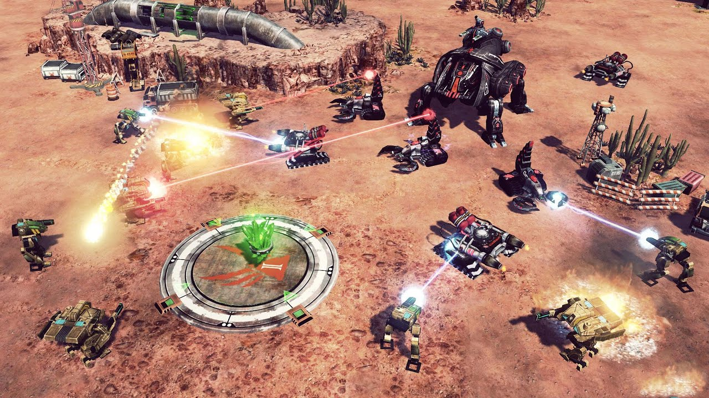

# Collider

_[Back To Entity Components](overview.md)_

This component defines the shape of an entity with a [RigidBody](rigidbody.md) for the purposes of physics collision
detection.

`Collider` is an abstract component and cannot be used directly. Its concrete implementation classes are:

- `BoxCollider` (a rect-shaped collider with a center, width and height)
- `CircleCollider` (a circular-shaped collider with a center and radius)

## Public Methods

| Method                 | Description                                                                                                                                                 |
|------------------------|-------------------------------------------------------------------------------------------------------------------------------------------------------------|
| `setMetaData`          | Sets a custom object with user-defined attributes as the metadata. You can retrieve this metadata to identify specific `Collider` components in a collision |
| `setOffset`            | Sets the local offset relative to the entity's `RigidBody` component                                                                                        |
| `setCollisionListener` | Sets a collision listener to be notified when this collider collides with another collider                                                                  |
| `setCollisionFilter`   | Set the collision category this collider resides in, and a layer mask indicating other categories this collider can collide with                            |
| `setDensity`           | Sets the density of this shape in kg/m<sup>2</sup>                                                                                                          |
| `setRestitution`       | Sets the coefficient of restitution, which represents how bouncy this collider surface is                                                                   |
| `setFriction`          | Sets the coefficient of friction, which represents how rough this collider surface is                                                                       |
| `setSensor`            | Sets the collider as a sensor/trigger. Sensors detect a collision but don't react to it                                                                     |

## Collision filtering

Collision filtering allows you to place colliders categories and also determine which other categeories they can
interact with.

We'll use a real example to elaborate. Below is a screenshot of the realtime strategy game "Command & Conquer: Tiberium
Twilight".

{:style="display:block;width:65%;margin:0 auto;"}

In this game, you build a base, mine resources and defend against enemies. During combat, it would make sense for player
units to be able to shoot through other player units to hit enemies. As such, the physics colliders of player artillery
should not interact with each other and should not also interact with player unit colliders, only with enemy unit
colliders.

This gives us four (4) collision layers whose collision interaction are defined in the table below:

1. Player units (PU)
2. Player artillery (PA)
3. Enemy units (EU)
4. Enemy artillery (EA)

|        | EA | EU | PA | PU |
|:------:|:--:|:--:|:--:|:--:|
| **PU** | ✅  | ✅  | ❌  | ❌  |
| **PA** | ❌  | ✅  | ❌  |    |
| **EU** | ❌  | ❌  |    |    |
| **EA** | ❌  |    |    |    |

From the deductions above, the collision layers and masks for each of the colliders are specified in the table below:

| Collider              | Collision Category<br/><small>Category collider resides in</small> | Collision Mask<br/><small>Categories collider can interact with</small> |
|-----------------------|:------------------------------------------------------------------:|:-----------------------------------------------------------------------:|
| Player units (PU)     |                   (2<sup>0</sup>) = 1 = 00000001                   |                                 4 \| 8                                  |
| Player artillery (PA) |                   (2<sup>1</sup>) = 2 = 00000010                   |                                    4                                    |
| Enemy units (EU)      |                   (2<sup>2</sup>) = 4 = 00000100                   |                                 1 \| 2                                  |
| Enemy artillery (EA)  |                   (2<sup>3</sup>) = 8 = 00001000                   |                                    1                                    |

> We use powers of 2 for each collision category since it's optimal for bitwise operations when defining collision
> masks. This gives us up to 32 collision layers since the max integer in Java is 2<sup>32</sup> - 1.

In code, we'd use the following to assign these categories to the respective colliders

```java
Collider playerUnitCollider = /* Code to retrieve player unit collider componnent from entity */;
playerUnitCollider.setCollisionFilter(1, 4 | 8);
...
Collider playerArtilleryCollider = /* Code to retrieve player artillery collider componnent from entity */;
playerArtilleryCollider.setCollisionFilter(2, 4);
...
Collider enemyUnitCollider = /* Code to retrieve enemy unit collider componnent from entity */;
enemyUnitCollider.setCollisionFilter(4, 1 | 2);
...
Collider enemyArtilleryCollider = /* Code to retrieve enemy artillery collider componnent from entity */;
enemyArtilleryCollider.setCollisionFilter(8, 1);
```
