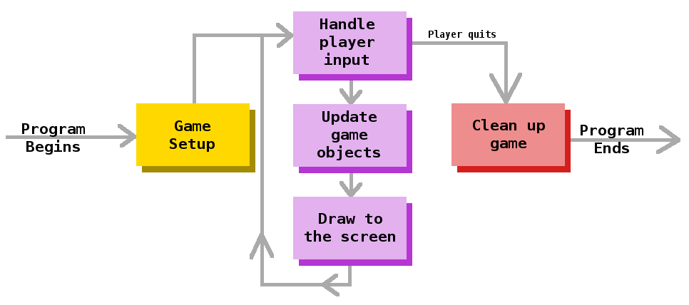
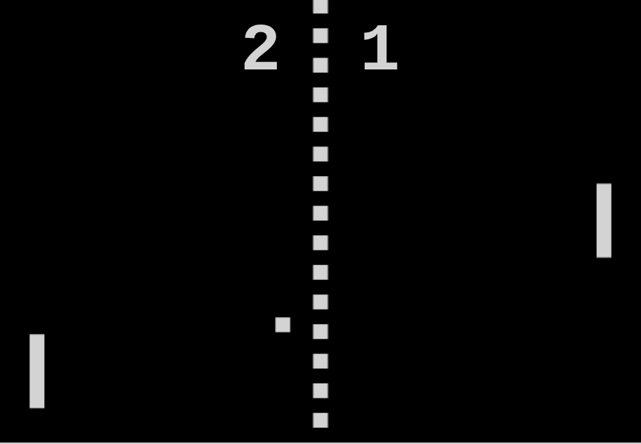

# Tutorials

These tutorials will take you from zero to hero in building games with GameKit.

## Requirements

As mentioned previously, GameKit is a 2D **Java** game engine which is distributed as a **Maven** dependency. To use
this engine, you must have the following installed and configured:

1. Java Development Kit (JDK) and Java Runtime Environment (JRE) (18+)
2. A Java IDE (IntelliJ IDEA, _Eclipse_, _Netbeans_, _VSCode_, etc)
3. Maven build tool and dependency manager (3.9.9+)

Next, you need to create a Maven Java project and [add the GameKit engine to your dependencies](/#installation).

## The GameKit Application

A GameKit application runs a game loop, manages a window and monitors the keyboard and mouse for user input.

To create one, you need to extend the `Application` class. Then in the `main` method, create a new instance of your
subclass and call the `run()` method to launch the game.

```java
import dev.gamekit.core.Application;

public class Game extends Application {
  public App() {
    super("Application Title Here");
  }

  public static void main(String[] args) {
    Game game = new Game();
    game.run();
  }
}
```

{:style="width:480px"}

### Additional Configuration

The `Application` class has additional settings which can be configured. To set one or more of these, pass a `Settings`
object to the Application constructor **in any order**, as shown below:

```java
import dev.gamekit.core.Application;
import dev.gamekit.settings.*;

public class Game extends Application {
  public App() {
    super(
      new Settings(
        "Application Title Here",
        Resolution.NATIVE,          // Window resolution          (VGA, SVGA, XGA, HD, WXGA, FULL_HD, NATIVE)
        WindowMode.FULLSCREEN,      // Window mode                (WINDOWED, BORDERLESS, FULLSCREEN)
        Antialiasing.ON,            // Image antialiasing         (DEFAULT, ON, OFF)
        TextAntialiasing.ON,        // Text antialiasing          (DEFAULT, ON, OFF)
        AlphaInterpolation.QUALITY, // Color alpha interpolation  (DEFAULT, QUALITY, SPEED)
        ImageInterpolation.BICUBIC, // Image interpolation        (DEFAULT, NEAREST, BILINEAR, BICUBIC)
        RenderingStrategy.QUALITY,  // Overall rendering strategy (DEFAULT, QUALITY, SPEED)
        Dithering.OFF               // Dithering                  (DEFAULT, ON, OFF)
      );
    );
  }

  public static void main(String[] args) {
    Game game = new App();
    game.run();
  }
}
```

### Access The Current Application Instance

When an application is instantiated, it is stored in a static variable within the `Application` class. Use
`Application.getInstance()` to get the current running instance of your application from anywhere within your code
to call public methods on it.

### Exit Your Application

When your game needs to exit , call the `Application.getInstance().quit()` method to quit.

## Scenes & Entities

A `Scene` represents a logical part of your game. This can be an intro showing the developers logo on start-up, the main
menu or a level/stage in your game. For your game to do anything useful, a scene must be loaded.

To create a scene, simply extend the `Scene` class and provide a name to the scene constructor. After creating a scene,
call the `loadScene(Scene)` method on your application instance to load it.

_The `loadScene(Scene)` method on the Application can be called before the game runs or as the game is running (I.e.
switching scenes)_

```java
import dev.gamekit.core.Application;
import dev.gamekit.core.Scene;

public class SimpleScene extends Scene {
  public SimpleScene() {
    super("Scene Name");
  }

  public static void main(String[] args) {
    Application game = new Application("Application Title") { };
    game.loadScene(new SimpleScene()); // <- Load the scene
    game.run();
  }
}
```

### Lifecycle Methods

A typical game consists of some setup phase, an input, update and render loop and a dispose phase (when exiting). This
is illustrated below:



The scene class provides methods for each of these phases that can be overridden to implement the functionality you
need. These methods are called by the `Application` at different stages.

```java
import dev.gamekit.core.Application;
import dev.gamekit.core.Scene;

public class SimpleScene extends Scene {
  public SimpleScene() {
    super("Scene Name");
  }

  public static void main(String[] args) {
    Application game = new Application("Application Title") { };
    game.loadScene(new SimpleScene());
    game.run();
  }

  @Override
  protected void start() {
    // Called once to set up the scene
  }

  @Override
  protected void update() {
    // Called every frame to update the scene (Can be called multiple times per frame due to delays in game loop)
  }

  @Override
  protected void render() {
    // Called every frame to render the scene
  }

  @Override
  protected void dispose() {
    // Called once to dispose the scene
  }
}
```

While these methods are enough to implement the functionality within the scene for simple game ideas, it's generally a
good idea to break apart functionality into distinct parts.

Let's take the classic [pong](https://www.ponggame.org/) game as an example. It consists of a puck, two paddles and the
walls and score areas.



You'd agree with me that while the functionality of all these can be written into a single scene class, it wouldn't be
considered good programming practice, since each element has a distinct purpose.

- The puck is the object of focus and bounces around the scene using physics
- The paddles move vertically to deflect the puck and are controlled by players and/or the computer
- The vertical walls keep the puck in the play area
- The score areas register collisions with the puck and increment the scores

It would make sense to split these into different _entities_ and have the scene manage interactions with each other.
This is where the `Entity` class comes in.

An `Entity` represents an independent object that exists within a scene/game world. Entities have similar lifecycle
methods as scenes, and are managed by a scene or their parent entities.

> Fun fact: A scene is actually a special kind of entity with the ability to render a user interface (more on this
> later) and is managed by the `Application`.

### Entity Parents

Both scenes and entities can contain children entities and manage their lifecycle. When a scene is disposed of from the
application, or an entity is removed from its scene or parent, all of its children are also disposed of.

Use the `addChild(Entity)` and `removeChild(Entity)` methods to add and remove children from scenes/entities
respectively.

## Rendering Stuff

A game wouldn't really be much of a game, if you couldn't see anything on the screen. In GameKit, the ability to draw
anything to the screen is handled by the static `Renderer` class.

Anytime the renderer is used, it adds a draw call to the render queue. **Draw calls** are objects which instructs the
render thread to draw something to the window.

The table below shows all the available methods of `Renderer`:

| Method                        | Description                                                           |
|-------------------------------|-----------------------------------------------------------------------|
| `Renderer.clear`              | Clears the visible window area with a color                           |
| `Renderer.drawLine`           | Draws a line between two pairs of coordinates                         |
| `Renderer.drawVerticalLine`   | Draws a vertical line between two y-coordinates and an x-coordinate   |
| `Renderer.drawHorizontalLine` | Draws a horizontal line between two x-coordinates and an y-coordinate |
| `Renderer.fillRect`           | Fills a **center-origin** rectangle                                   |
| `Renderer.drawRect`           | Outlines a **center-origin** rectangle                                |
| `Renderer.fillRoundRect`      | Fills a **center-origin** rounded rectangle                           |
| `Renderer.drawRoundRect`      | Outlines a **center-origin** rounded rectangle                        |
| `Renderer.fillOval`           | Fills a **center-origin** oval                                        |
| `Renderer.drawOval`           | Outlines a **center-origin** oval                                     |
| `Renderer.fillCircle`         | Fills a **center-origin** circle                                      |
| `Renderer.drawCircle`         | Outlines a **center-origin** circle                                   |
| `Renderer.drawImage`          | Draws a **center-origin** image                                       |
| `Renderer.fillPolygon`        | Fills a polygon from a point array                                    |
| `Renderer.drawPolygon`        | Outlines a polygon from a point array                                 |

### Render Attributes

Draw calls can further be enhanced with attributes which customize their operation. These attributes are defined in the
table below:

| Attribute | Method Call                    | Description                                                                             |
|-----------|--------------------------------|-----------------------------------------------------------------------------------------|
| Color     | `withColor(Color)`             | Sets the foreground color of the draw call                                              |
| Stroke    | `withStroke(Stroke)`           | Sets the border stroke (width and type) of the draw call                                |
| Paint     | `withPaint(Paint)`             | Sets the paint of the draw call. Paint allows drawing of gradients                      |
| Clip      | `withClip(int,int,int,int)`    | Sets the clip region of the draw call which prevents drawing outside the specified area |
| Rotation  | `withRotation(int,int,double)` | Sets the clockwise rotation in radian of the draw call                                  |

### Rendering Sample

The sample below is a scene which uses the renderer methods and attributes shown above:

```java
import dev.gamekit.core.Application;
import dev.gamekit.core.IO;
import dev.gamekit.core.Scene;

import java.awt.*;
import java.awt.image.BufferedImage;

public class RendererScene extends Scene {
  private static final BufferedImage IMAGE = IO.getResourceImage("test.jpg");
  private static final int[] POLYGON_POINTS = new int[]{ 90, -190, 110, -110, 50, -99 };
  private static final Stroke DEFAULT_STROKE = new BasicStroke(2, BasicStroke.CAP_ROUND, BasicStroke.JOIN_ROUND);

  public RendererScene() {
    super("Rendering Showcase");
  }

  public static void main(String[] args) {
    Application game = new Application("Renderer Showcase") { };
    game.loadScene(new RendererScene());
    game.run();
  }

  @Override
  protected void render() {
    Renderer.clear(Color.DARK_GRAY);

    Renderer.drawLine(0, 0, 10, 10).withColor(Color.GREEN);
    Renderer.drawVerticalLine(0, -20, -4).withStroke(DEFAULT_STROKE);
    Renderer.drawHorizontalLine(0, 20, 5).withColor(Color.GREEN).withStroke(DEFAULT_STROKE);

    Renderer.drawRect(0, 0, 50, 20); // A 50x20 rect centered at (0, 0)
    Renderer.fillRect(0, 0, 48, 16);

    Renderer.drawRoundRect(50, 50, 75, 20, 4, 4); // A 75x20 rect centered at (50, 50) with horizontal arc radius 4 and vertical arc radius 4
    Renderer.fillRoundRect(50, 50, 75, 20, 4, 4);

    Renderer.drawOval(10, 20, 50, 30); // A 50x30 oval centered at (10, 20)
    Renderer.fillOval(10, 20, 48, 16);

    Renderer.drawCircle(30, 30, 50); // A 50px radius circle centered at (30, 30)
    Renderer.fillCircle(30, 30, 48);

    Renderer.drawImage(IMAGE, 100, 100, 300, 200)
      .withRotation(100, 100, 0.5 * Math.PI); // A 300x200 image centered at (100, 100) rotated by 90 degrees about (100, 100)

    Renderer.drawPolygon(POLYGON_POINTS)
      .withClip(0, 0, 100, 100); // Polygon points cliped to the area defined by top-left (0, 0) and width and height of 100x100
    Renderer.fillPolygon(POLYGON_POINTS);
  }
}
```

## Loading Assets

While building your game, chances are, you'd need to import images, audio, fonts or other external resources. GameKit
allows you to do this via the static `IO` class.

`IO` caches resources it loads, making subsequent queries instantaneous, which improves overall performance of your
game.

`IO` also keeps references to any open streams, which it closes when the application exits. While this is
convenient, it's good practice to close streams manually when done.

> Since we are using Java here, you need to ensure that your external directory is added to the classpath.
>
> For Maven projects, this is the `src/main/java/resources/` directory which should already be added, however, be sure
> to check your IDE settings.

The table below shows all the available methods of `IO`:

| Method                 | Description                                                                                                    |
|------------------------|----------------------------------------------------------------------------------------------------------------|
| `IO.getResourceStream` | Opens and returns a stream to a resource file                                                                  |
| `IO.getResourceImage`  | Loads and caches an image resource file. This method is overloaded to return a slice of an image resource file |
| `IO.getResourceFont`   | Loads and caches a font resource file                                                                          |

## Handling Input

Detecting player input in GameKit is done using the static `Input` class. `Input` detects and gathers **keyboard** and
**mouse** inputs to be used during the update phase of the game loop.

`Input` allows you to check the following states for keyboard keys and mouse buttons:

- Key/Button has just been pressed
- Key/Button is being held
- Key/Button has just been released

The table below shows all the available methods of `Input`:

| Method                   | Description                                                                            |
|--------------------------|----------------------------------------------------------------------------------------|
| `Input.isKeyDown`        | Checks if a key matching the given keycode has been pressed in the current frame       |
| `Input.isKeyPressed`     | Checks if a key matching the given keycode is being held down                          |
| `Input.isKeyReleased`    | Checks if a key matching the given keycode has been released in the current frame      |
| `Input.isButtonDown`     | Checks if a button matching the given button id has been pressed in the current frame  |
| `Input.isButtonPressed`  | Checks if a button matching the given button id is being held down                     |
| `Input.isButtonReleased` | Checks if a button matching the given button id has been released in the current frame |

### Input Sample

The sample below showcases how `Input` methods are used. When the left mouse button or space bar is pressed, held and
released, it prints out to the console.

```java
import dev.gamekit.core.Application;
import dev.gamekit.core.Input;
import dev.gamekit.core.Scene;

public class InputSample extends Scene {
  public InputSample() {
    super("Main Scene");
  }

  public static void main(String[] args) {
    Application game = new Application("Input Sample") { };
    game.loadScene(new InputSample());
    game.run();
  }

  @Override
  protected void update() {
    if (Input.isButtonDown(Input.BUTTON_LMB)) {
      logger.debug("Left Mouse Button pressed");
    } else if (Input.isButtonPressed(Input.BUTTON_LMB)) {
      logger.debug("Left Mouse Button is being held");
    } else if (Input.isButtonReleased(Input.BUTTON_LMB)) {
      logger.debug("Left Mouse Button released");
    }
    
    if (Input.isKeyDown(Input.KEY_SPACE)) {
      logger.debug("Space Bar pressed");
    } else if (Input.isKeyPressed(Input.BUTTON_LMB)) {
      logger.debug("Space Bar is being held");
    } else if (Input.isKeyReleased(Input.BUTTON_LMB)) {
      logger.debug("Space Bar released");
    }
  }
}
```

## Working With Audio

> This is an introduction to GameKit's audio system. Visit the full documentation [here](/audio).

Music and sound effects add more life to your game, which improves player immersion. GameKit supports audio playback in
a simple yet powerful manner.

GameKit supports both 2D (non-spatial) audio and 3D (spatial) audio.

2D audio is great for background music and UI element feedback, while 3D audio works best for sounds which sound
differently depending on their location in your game world. (E.g. camp fireplace and explosions)

The general workflow for audio in GameKit is as follows:

- Preload audio file into an audio clip
- Assign audio clip to an audio group
- Begin/Pause/Stop playback of your clip within your game

The sample below illustrates this process. Here we preload a resource file "sample.wav", then we use the space bar press
to start/stop playback.

```java
import dev.gamekit.audio.AudioClip2D;
import dev.gamekit.audio.AudioGroup;
import dev.gamekit.core.Application;
import dev.gamekit.core.Input;
import dev.gamekit.core.Scene;
import dev.gamekit.core.Audio;

public class AudioSample extends Scene {
  private static final String MUSIC_CLIP_KEY = "music";
  
  private boolean playing = false;

  public AudioSample() {
    super("Main Scene");
    
    Audio.preload(
      MUSIC_CLIP_KEY,
      new AudioClip2D(
        "sample.wav", 
        AudioGroup.MUSIC, 
        1 // Max volume (0 - 1)
      )
    );
  }

  public static void main(String[] args) {
    Application game = new Application("Audio Sample") { };
    game.loadScene(new AudioSample());
    game.run();
  }

  @Override
  protected void update() {
    if (Input.isKeyDown(Input.KEY_SPACE)) {
      if (!playing) {
        Audio.get(MUSIC_CLIP_KEY).play();
        playing = true;
      } else {
        Audio.get(MUSIC_CLIP_KEY).stop()
        playing = false;
      }
    }
  }
}
```

### Full Documentation

As stated earlier, this is just an introduction to GameKit's audio system. Visit the full
documentation [here](/audio).

## Scene Camera

## User Interface
