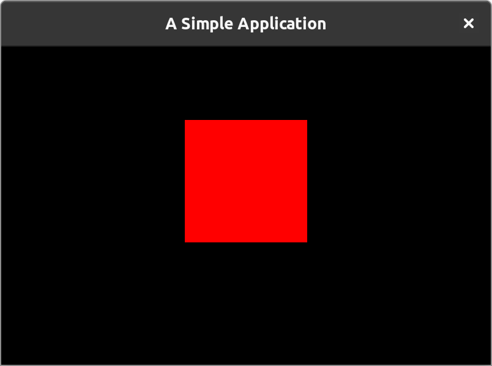

# Getting Started

In this document, we'll cover how to install GameKit and build a simple application with it.

## Installation

GameKit is distributed as a **Maven** dependency.

To include it in your project, add its dependency to your `pom.xml`, then reload the Maven project in your IDE or run
`mvn clean compile` to download the dependencies.

```xml
<?xml version="1.0" encoding="UTF-8"?>

<project>
    ...
    <repositories>
        ...
        <!-- Include the repository block -->
        <repository>
            <id>github-maven</id>
            <name>GameKit GitHub Maven</name>
            <url>https://raw.github.com/kwameopareasiedu/gamekit-maven/master</url>
        </repository>
    </repositories>

    <dependencies>
        ...
        <!-- Include the dependency block -->
        <dependency>
            <groupId>dev.gamekit</groupId>
            <artifactId>engine</artifactId>
            <!-- Replace`{VERSION} with the intended version -->
            <version>{VERSION}</version>
        </dependency>
    </dependencies>
</project>
```

> Find all versions on the [releases](https://github.com/kwameopareasiedu/gamekit/releases) page.

## Hello Game

Let's get started with a very simple application. Think of this as a "Hello World" GameKit sample.

`HelloGame.java`

```java
import dev.gamekit.core.Application;
import dev.gamekit.core.Renderer;
import dev.gamekit.core.Scene;

import java.awt.Color;

public class HelloGame extends Scene {
  public HelloGame() {
    super("Hello Game");
  }

  public static void main(String[] args) {
    // Create a new application
    Application game = new Application("A Simple Application") { };

    // Load an instance of our scene class
    game.loadScene(new HelloGame());

    // Run the game application
    game.run();
  }

  @Override
  public void render() {
    // Clear the screen with black
    Renderer.clear(Color.BLACK);

    // Draw a red-filled box
    Renderer.fillRect(0, 0, 200, 200).withColor(Color.RED);
  }
}
```

Running this application should give you a window like this:

{:style="max-width:480px;width:100%"}

### What we have done

- We extended the `Scene` class, which represents a logical part of our game (_More on scenes later_).
- In the `render` lifecycle method, we cleared the screen with color.
  black <span style="display:inline-block;width:10px;height:10px;background:black"></span> and drew a red 200x200px
  <span style="display:inline-block;width:10px;height:10px;background:red"></span> box.
- In the static `main` method, we created an `Application` instance with title, _"A Simple Application"_, loaded an
  instance of our scene subclass and called the `run` method to start the application.

## A Shallow Dive In

In the previous section, we extended the `Scene` class, rendered stuff unto the window and created an `Application` to
run it all.

We'll take it a step further in this section by creating a simple color switcher game which will render a colored box
and when the space bar is pressed, it will cycle through <span style="background-color:red;padding:2px 4px;">red</span>,
<span style="background-color:yellow;padding:2px 4px;">yellow</span> and
<span style="background-color:green;padding:2px 4px;color:white;">green</span>, as shown below.

<video controls style="max-width:480px;width:100%">
  <source src="/assets/gamekit-color-switcher.mp4">
</video>

`ColorSwitcher.java`

```java
import dev.gamekit.core.Application;
import dev.gamekit.core.Input;
import dev.gamekit.core.Renderer;
import dev.gamekit.core.Scene;
import dev.gamekit.ui.enums.Alignment;
import dev.gamekit.ui.widgets.Align;
import dev.gamekit.ui.widgets.Padding;
import dev.gamekit.ui.widgets.Text;
import dev.gamekit.ui.widgets.Widget;
import dev.gamekit.utils.Math;

import java.awt.*;

public class ColorSwitcher extends Scene {
  private static final Color[] COLORS = { Color.RED, Color.YELLOW, Color.GREEN };
  private static final String[] COLOR_NAMES = { "Red", "Yellow", "Green" };

  private int selectedIndex = 0;

  public ColorSwitcher() {
    super("Gameplay");
  }

  public static void main(String[] args) {
    Application game = new Application("Color Switcher") { };
    game.loadScene(new ColorSwitcher());
    game.run();
  }

  @Override
  protected void update() {
    if (Input.isKeyDown(Input.KEY_SPACE)) {
      selectedIndex = Math.cycle(selectedIndex + 1, 0, COLORS.length - 1);
      updateUI();
    }
  }

  @Override
  protected void render() {
    Renderer.clear(Color.DARK_GRAY);
    Renderer.fillRect(0, 0, 200, 200).withColor(COLORS[selectedIndex]);
  }

  @Override
  protected Widget createUI() {
    return Align.create(
      props -> {
        props.horizontalAlignment = Alignment.CENTER;
        props.verticalAlignment = Alignment.END;
      },
      Padding.create(
        48, Text.create(
          props -> {
            props.text = String.format("Color is %s", COLOR_NAMES[selectedIndex]);
            props.fontSize = 32;
            props.alignment = Alignment.CENTER;
            props.fontStyle = Text.BOLD;
          }
        )
      )
    );
  }
}
```

### What we have done

- We extended the `Scene` class which represents a logical part of our game.
- We defined our color and color names arrays with a `selectedIndex` field.
- In the `update` lifecycle method we check if the space bar has just been pressed using the `Input` class and cycle the
  `selectedIndex` between 0 and `COLORS.length`. We also call `updateUI` to indicate that the UI should be rebuilt,
  since we use the value of `selectedIndex` in our UI definition.
- In the `render` lifecycle method, we cleared the screen with color black and box using the selected color.
- In the `createUI` lifecycle method, we created a centered, bottom-aligned text with padding of 48px which displays _"
  Color is {SELECTED_COLOR}"_.
- In the static `main` method, we created an `Application` instance with title, _"Color Switcher"_, loaded an instance
  of our scene subclass and called the `run` method to start the application.

## Next Steps

Congratulations on making to the end of this getting-started guide and creating your first game with GameKit. Hopefully,
you can see how easy it is to create games with the engine.

As you delve more into the documentation, we'll explore more GameKit features such as audio, physics, input, UI and IO.

From here, you can check out more [examples](./examples.md) or explore the engine [features](../features/overview.md).
