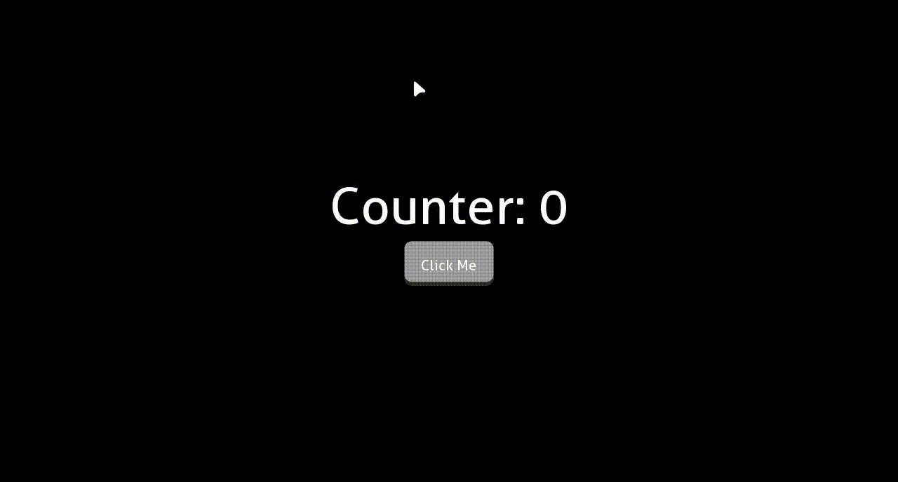

# User Interface (UI)

In the context of games, a user interface is a group of visual components that is usually overlaid on the game world.
This conveys information to the player, usually about the state of the current level and also allows for player input.

These components include text, buttons, sliders, inputs and toggles amongst others. The screenshot below showcases the
UI from a game created with the engine, <a href="https://kwameopareasiedu.itch.io/industrio" target="_blank">
Industrio</a>.

<div class="caption-image-container">
  
  <small>User Interface Example (Industrio)</small>
</div>

## Getting Started

In GameKit, the user interface (UI) is created and managed by the `Scene` class. To create a UI for your scene, you
override the `createUI` method as shown below:

```java
import dev.gamekit.core.Application;
import dev.gamekit.core.Input;
import dev.gamekit.core.Scene;
import dev.gamekit.ui.enums.Alignment;
import dev.gamekit.ui.enums.CrossAxisAlignment;
import dev.gamekit.ui.widgets.*;

public class UserInterfaceSample extends Scene {
  private String titleText = "Hello GameKit";
  
  public UserInterfaceSample() {
    super("UI Scene");
  }

  public static void main(String[] args) {
    Application game = new Application("User Interface") { };
    game.loadScene(new UserInterfaceSample());
    game.run();
  }

  @Override
  protected Widget createUI() {
    return Center.create(
      Column.create(
        Column.config().crossAxisAlignment(CrossAxisAlignment.STRETCH),
        Text.create(
          Text.config().fontSize(72).alignment(Alignment.CENTER),
          titleText
        ),
        Text.create(
          Text.config().fontSize(24).alignment(Alignment.CENTER),
          "User Interface Sample"
        )
      )
    );
  }
}
```

Here, the root of the UI is a `Center` widget which, well, centers its child. Within the `Center` widget, we create a
`Column` widget which stretches its children horizontally and contains two `Text` widgets. The resulting UI looks like
this:

<div class="caption-image-container" style="width: 48%; margin-right:1%;">
  
  <small>User Interface Sample</small>
</div>

<div class="caption-image-container" style="width: 48%">
  
  <small>User Interface Sample (Showing bounds)</small>
</div>

## Widgets

Widgets are the building blocks of UI in GameKit. Formally speaking, a widget is an abstract representation of a portion
of a scene's user interface.

Widgets are used to describe all aspects of a user interface, including physical aspects such as text and buttons to
layout effects like padding and alignment.

Widgets in GameKit take **heavy inspiration** from
<a href="https://docs.flutter.dev/ui/layout/constraints" target="_blank">Flutter's Box Constraint model</a> which I
highly recommend checking out for a more grounded understanding of how to create widgets in GameKit.

### Widget Catalog

GameKit ships with several widgets which you can use to create most kinds of layout. These are grouped into two types:
**parent widgets** and **leaf widgets**.

#### Parent Widgets

As their name implies, these are widgets which nest one or more widgets within them. Parents are _generally_ used for
layout and don't have an appearance themselves.

The table below lists and describes all parent widget provided by GameKit.

| Widget     | Type                | Description                                                                                                        |
|------------|---------------------|--------------------------------------------------------------------------------------------------------------------|
| `Row`      | `MultiChildParent`  | Lays out its children in a horizontal axis                                                                         |
| `Column`   | `MultiChildParent`  | Lays out its children in a vertical axis                                                                           |
| `Stack`    | `MultiChildParent`  | Lays out its children on top of each other                                                                         |
| `Scaled`   | `SingleChildParent` | Scales its child by a given factor                                                                                 |
| `Padding`  | `SingleChildParent` | Adds internal spacing around its child                                                                             |
| `Align`    | `SingleChildParent` | Aligns its child within itself                                                                                     |
| `Sized`    | `SingleChildParent` | Constrains its child to a fixed or proportional size                                                               |
| `Theme`    | `SingleChildParent` | Sets common theme values for its descendants                                                                       |
| `Panel`    | `SingleChildParent` | Renders a background behind its child using the [9-patch](https://en.wikipedia.org/wiki/9-slice_scaling) algorithm |
| `Opacity`  | `SingleChildParent` | Renders its descendants with transparency                                                                          |
| `Button`   | `SingleChildParent` | Triggers an action when clicked, while rendering its child as-is                                                   |
| `Checkbox` | `SingleChildParent` | Renders a checkbox to the left of its child                                                                        |
| `Compose`  | `SingleChildParent` | A base for creating custom widget trees                                                                            |

#### Leaf Widgets

Leaf widgets are standalone widgets which render a distinct appearance.

The table below lists and describes all leaf widget provided by GameKit.

| Widget     | Description                                                                        |
|------------|------------------------------------------------------------------------------------|
| `Text`     | Renders text with specific properties                                              |
| `Field`    | A `Text` widget extension which accepts input                                      |
| `Image`    | Renders an image                                                                   |
| `Progress` | Renders a configurable progress bar                                                |
| `Slider`   | A `Progress` widget extension which updates a value by moving a slider knob        |
| `Colored`  | Renders a solid color background                                                   |
| `Empty`    | A no-size component which renders nothing. It's is the widget equivalent of `null` |

## Widget Instantiation

Widget instances are created by using the static `create` method on the widget's class. The widget can accept a
configuration object, a child widget/list or both, as shown below:

```java
// Stack widget needs no configuration, so it just accepts the list of children
Stack.create(
  Text.create("Hello"),
  Text.create("World"),
);

// Columns can accept a list of children and/or a configuration object
Column.create(
  Text.create("Hello"),
  Text.create("World"),
)

Column.create(
  Column.config(),
  Text.create("Hello"),
  Text.create("World"),
)
```

The configuration object can also be created by calling the static `config()` method on the widget, then chaining
property method calls on it:

```java
Padding.create(
  Padding.config().padding(24, 0, 0, 24), // Top, Right, Bottom, Left
  Column.create(
    Column.config().gapSize(24).crossAxisAlignment(CrossAxisAlignment.CENTER),
    Text.create("Hello"),
    Text.create("World"),
  )
)
```

## UI Updates

UI is rarely static. There comes a point when you need to update variables whose values are used in them. In most game
engines, you'd have to get a reference to a UI component instance and calling methods on it.

As an example, here's a screenshot from a previous game project created with the Godot engine. The task here was to
update the text field of a UI label node.

You'd notice on line 12, that we grab a references to the `$CanvasLayer/LandedLabel` node, then on line 44, we update
the text string.

<div class="caption-image-container">
  
  <small>Godot Imperative UI Update</small>
</div>

<br>This approach to updating UI is known makes the UI system an **imperative** one. With imperative UI, you have to
explicitly specify **how** updates need be performed.

GameKit, like the Flutter framework referenced above, uses another approach in its UI system known as a **declarative**
approach.

With the declarative approach, you specify **what** the final state of the UI should be, then have the engine compute
the steps needed to take the UI from its current state to your desired state.

> One core difference is that imperative UI focuses on the **component/widget instances**, while declarative UI focuses
> on the **state of the UI**.

### GameKit UI Updates

To put into practice, what we discussed above, let's have a simple layout of a button and text. When the button is
pressed, we increase a counter variable which reflects in the text widget.

_The state of the UI is the collection of variables and constants which the UI depends on_ and here, the state of the UI
comprises the `counter` variable.

```java
import dev.gamekit.core.Application;
import dev.gamekit.core.Renderer;
import dev.gamekit.core.Scene;
import dev.gamekit.settings.Resolution;
import dev.gamekit.settings.Settings;
import dev.gamekit.settings.TextAntialiasing;
import dev.gamekit.settings.WindowMode;
import dev.gamekit.ui.enums.Alignment;
import dev.gamekit.ui.enums.CrossAxisAlignment;
import dev.gamekit.ui.events.MouseEvent;
import dev.gamekit.ui.widgets.*;
import dev.gamekit.ui.widgets.Button;

import java.awt.*;

public class UiUpdateExample extends Scene {
  private int counter = 0;

  public UiUpdateExample() {
    super("Playground");
  }

  public static void main(String[] args) {
    Application game = new Application(
      new Settings(
        "Playground",
        WindowMode.WINDOWED,
        Resolution.HD,
        TextAntialiasing.ON
      )
    ) { };
    game.loadScene(new UiUpdateExample());
    game.run();
  }

  @Override
  protected void render() {
    Renderer.clear(Color.BLACK);
  }

  @Override
  protected Widget createUI() {
    return Center.create(
      Column.create(
        Column.config().crossAxisAlignment(CrossAxisAlignment.CENTER).gapSize(24),
        Text.create(
          Text.config().fontSize(72).alignment(Alignment.CENTER),
          String.format("Counter: %d", counter)
        ),
        Sized.create(
          Sized.config().width(128).height(64),
          Button.create(
            Button.config().mouseListener(this::incrementCounter),
            Text.create("Click Me")
          )
        )
      )
    );
  }

  private void incrementCounter(MouseEvent event) {
    if (event.type == MouseEvent.Type.CLICK) {
      counter++;
      updateUI();
    }
  }
}
```

Our focus in the `incrementCounter` method in the code above. Here we increment the `counter` by 1, essentially changing
the state of our UI. Anytime you change any UI state, you need to call the `updateUI()` method of the scene class to
reflect the change.

This is all there is to it on updating UI in GameKit. No keeping track of UI instances, no method calls on UI instances.
Just change your state and call `updateUI()`.

Running this example results in the application showcased below:


